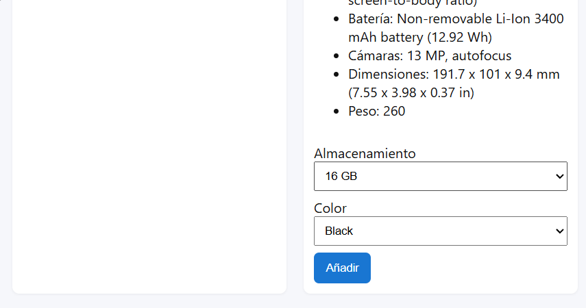

# Front-End Test - ITX Shop

Mini SPA para compra de dispositivos moviles, implementada con React + TypeScript.

## Objetivo de la prueba

Aplicacion con dos vistas:

- PLP (Product List Page): listado de productos con filtro en tiempo real por marca/modelo.
- PDP (Product Detail Page): detalle de producto, seleccion de color y almacenamiento, y accion de anadir al carrito.

## Stack tecnico

- React 18
- TypeScript
- Vite
- React Router DOM
- ESLint
- Vitest + Testing Library
- localStorage para cache y persistencia

## API utilizada

Base URL:

`https://itx-frontend-test.onrender.com/`

Endpoints:

- `GET /api/product`
- `GET /api/product/:id`
- `POST /api/cart`

## Requisitos

- Node.js 18+ recomendado
- npm 9+ recomendado

## Instalacion

```bash
cd "d:\PROYECTOS\PRUEBA ESoluzion\front"
npm install
```

## Scripts

El proyecto incluye scripts en minuscula y alias en mayuscula para ajustarse al enunciado:

```bash
npm run start
npm run build
npm run test
npm run lint
```

```bash
npm run START
npm run BUILD
npm run TEST
npm run LINT
```

## Flujo recomendado antes de entregar

```bash
npm run lint
npm run test -- --run
npm run build
```

## Funcionalidades implementadas

- SPA con rutas cliente (`/` y `/product/:id`).
- Header con link a home, breadcrumbs y contador de carrito.
- Grid responsive de productos (maximo 4 por fila).
- Filtro por marca/modelo en tiempo real.
- Vista de detalle con informacion principal y tecnica.
- Selectores de color y almacenamiento con seleccion por defecto.
- Boton de anadir que envia `{ id, colorCode, storageCode }`.
- Persistencia del contador de carrito entre vistas y recargas.

## Cache en cliente (1 hora)

Se implementa cache en `localStorage` para:

- listado de productos
- detalle por producto

Cada entrada almacena timestamp y datos, con expiracion de 1 hora. Al expirar, se revalida contra API.

## Nota sobre el contador del carrito

Durante las pruebas, el endpoint `POST /api/cart` devuelve `count = 1` de forma constante.
Para mantener el comportamiento esperado por el enunciado (contador visible y acumulado), se aplica un fallback cliente:

- Si el `count` del servidor no aumenta, se incrementa el valor persistido localmente.

## Estructura principal

```text
front/
  src/
    components/
      Loader.tsx
      ProductItem.tsx
      Search.tsx
      Toast.tsx
    pages/
      ProductDetailPage.tsx
      ProductListPage.tsx
    tests/
      App.test.tsx
    api.ts
    App.tsx
    index.css
    main.tsx
    types.d.ts
  index.html
  package.json
  tsconfig.json
  vite.config.js
```

## Testing

- Test basico incluido para render de cabecera.
- Runner: Vitest.

## Linting

- ESLint configurado para TypeScript/React.

## Verificacion funcional

Entorno de prueba:

- SO: Windows
- Node.js: 18+
- npm: 9+

### Caso 1 - Carga de productos (PLP)

Pasos:

1. Ejecutar `npm run start`.
2. Abrir la aplicacion en el navegador.

Resultado esperado:

- Se muestra el listado de productos en grid responsive.

Resultado obtenido:

- OK.

### Caso 2 - Filtro por marca/modelo

Pasos:

1. Escribir texto en el input de busqueda (por ejemplo: `Acer`).

Resultado esperado:

- La lista se filtra en tiempo real por marca/modelo.

Resultado obtenido:

- OK.

### Caso 3 - Navegacion a detalle (PDP)

Pasos:

1. Hacer click en un producto del listado.

Resultado esperado:

- Navega a `/product/:id` y muestra detalle del producto.

Resultado obtenido:

- OK.

### Caso 4 - Selectores de color y almacenamiento

Pasos:

1. En la vista PDP, revisar los selectores de almacenamiento y color.

Resultado esperado:

- Se muestran opciones y queda una seleccion por defecto.

Resultado obtenido:

- OK.

### Caso 5 - Anadir al carrito y persistencia

Pasos:

1. Pulsar `Anadir`.
2. Verificar contador en cabecera.
3. Recargar pagina.

Resultado esperado:

- El contador incrementa y persiste tras recarga.

Resultado obtenido:

- OK.

### Caso 6 - Cache cliente (TTL 1 hora)

Pasos:

1. Cargar PLP/PDP al menos una vez.
2. Revisar claves de cache en `localStorage`.

Resultado esperado:

- Datos cacheados con timestamp y expiracion logica de 1 hora.

Resultado obtenido:

- OK.

## Evidencias (imagenes)

Si, se pueden poner imagenes en el README y es recomendable para una prueba tecnica.

Sugerencia de estructura:

```text
front/
  docs/
    images/
      actions.png
      plp.png
      pdp.png
      cart-counter.png
```

Ejemplo en Markdown:

```md



```

Evidencias incluidas:


## Mejoras futuras sugeridas

- Mas tests de integracion (PDP y flujo de add to cart).
- Skeletons de carga por card.
- Manejo centralizado de errores de API.