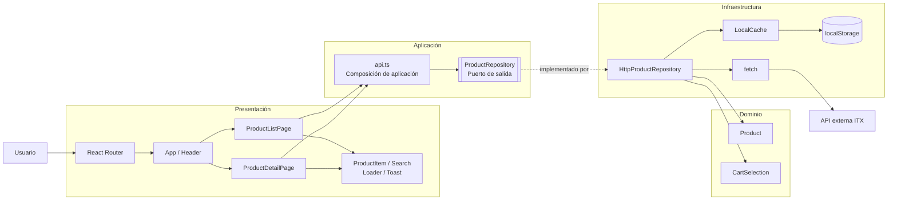
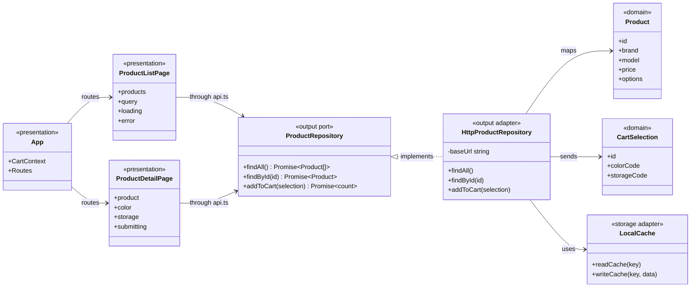
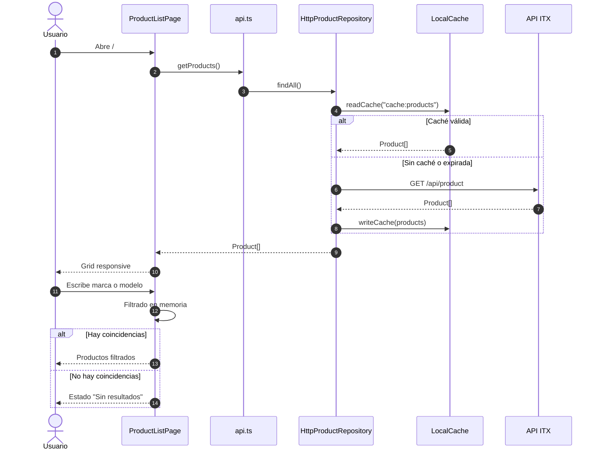
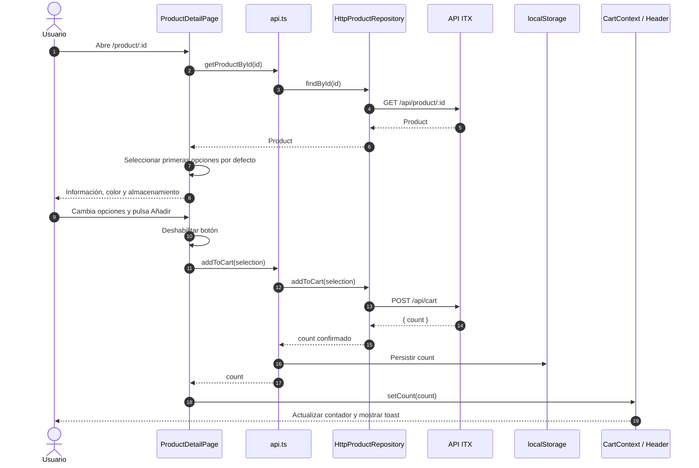
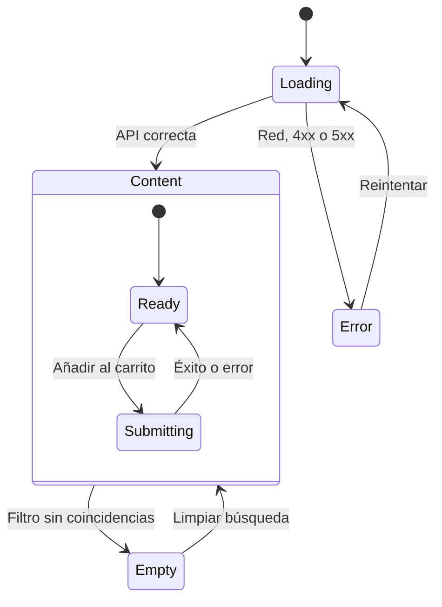
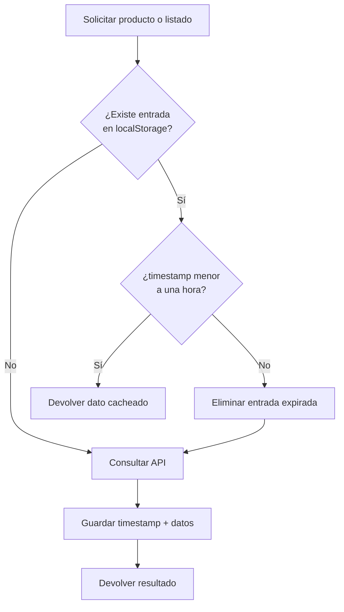
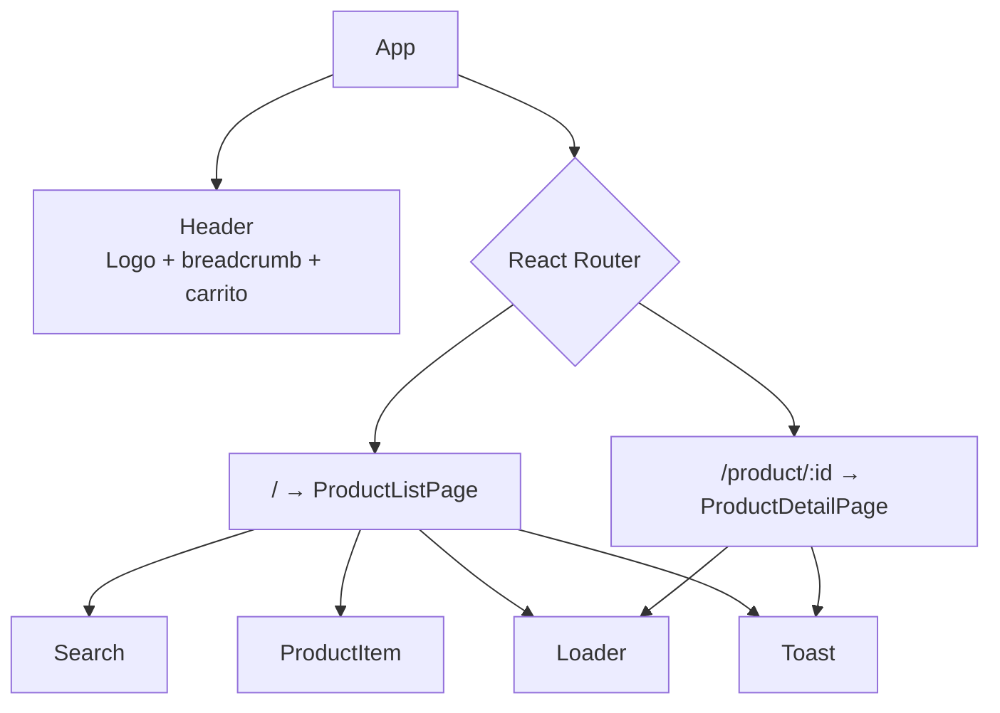
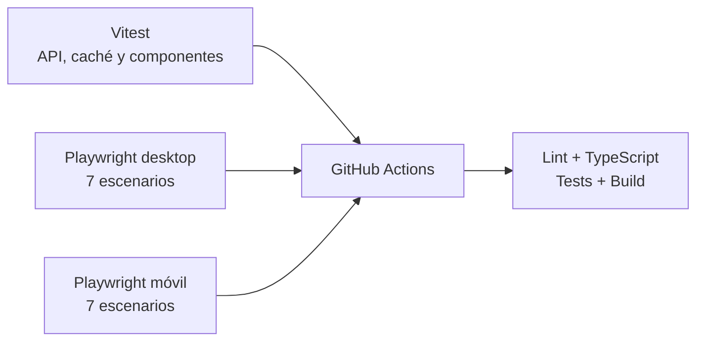

# Arquitectura y funcionamiento del frontend

Este documento explica visualmente cómo está organizada la SPA, cómo circulan los datos y cómo se separan la presentación, la aplicación, el dominio y la infraestructura.

## 1. Vista general

La interfaz depende de contratos y modelos propios. Los detalles de `fetch` y `localStorage` quedan en infraestructura, fuera de los componentes React.



### Dirección de dependencias

```text
Presentación → Aplicación → Dominio
                       ↑
              Infraestructura
```

`ProductRepository` define lo que necesita la aplicación. `HttpProductRepository` aporta la implementación concreta usando HTTP y caché local.

## 2. Módulos y responsabilidades



| Capa            | Elemento                | Responsabilidad                                                |
| --------------- | ----------------------- | -------------------------------------------------------------- |
| Dominio         | `Product`               | Definir los datos de producto usados por la aplicación         |
| Dominio         | `CartSelection`         | Definir el comando para añadir una variante al carrito         |
| Aplicación      | `ProductRepository`     | Especificar las operaciones requeridas sin depender de `fetch` |
| Aplicación      | `api.ts`                | Crear el adaptador y exponer operaciones sencillas a la UI     |
| Infraestructura | `HttpProductRepository` | Consumir la API REST y traducir sus respuestas                 |
| Infraestructura | `LocalCache`            | Leer, escribir y expirar datos después de una hora             |
| Presentación    | `App`                   | Definir rutas, cabecera, breadcrumb y contexto del carrito     |
| Presentación    | `ProductListPage`       | Gestionar listado, búsqueda, carga, error y estado vacío       |
| Presentación    | `ProductDetailPage`     | Gestionar detalle, opciones, envío y resultado del carrito     |
| Presentación    | Componentes             | Presentar unidades reutilizables y accesibles                  |

## 3. Flujo de la página de productos — PLP



## 4. Flujo de detalle y carrito — PDP



## 5. Estados de pantalla



Los estados están representados explícitamente:

- `loading`: indicador accesible de carga.
- `error`: mensaje persistente y botón de reintento.
- `empty`: mensaje sin resultados y limpieza del filtro.
- `submitting`: botón deshabilitado mientras se envía el carrito.
- `success`: actualización del contador y notificación mediante `aria-live`.

## 6. Caché de una hora



El contador del carrito utiliza otra clave de `localStorage`, pero conserva siempre el último `count` confirmado por el backend.

## 7. Rutas y componentes



## 8. Estrategia de pruebas



Los E2E simulan la API mediante rutas de Playwright. Así comprueban el flujo del navegador de forma determinista y no dependen de la disponibilidad del backend externo.

Los escenarios cubren:

1. Carga del listado y breadcrumb.
2. Filtro en tiempo real.
3. Estado sin resultados.
4. Navegación al detalle.
5. Selección y payload del carrito.
6. Estado de error y reintento.
7. Persistencia del contador.

Cada escenario se ejecuta en Chromium de escritorio y en un viewport móvil.
